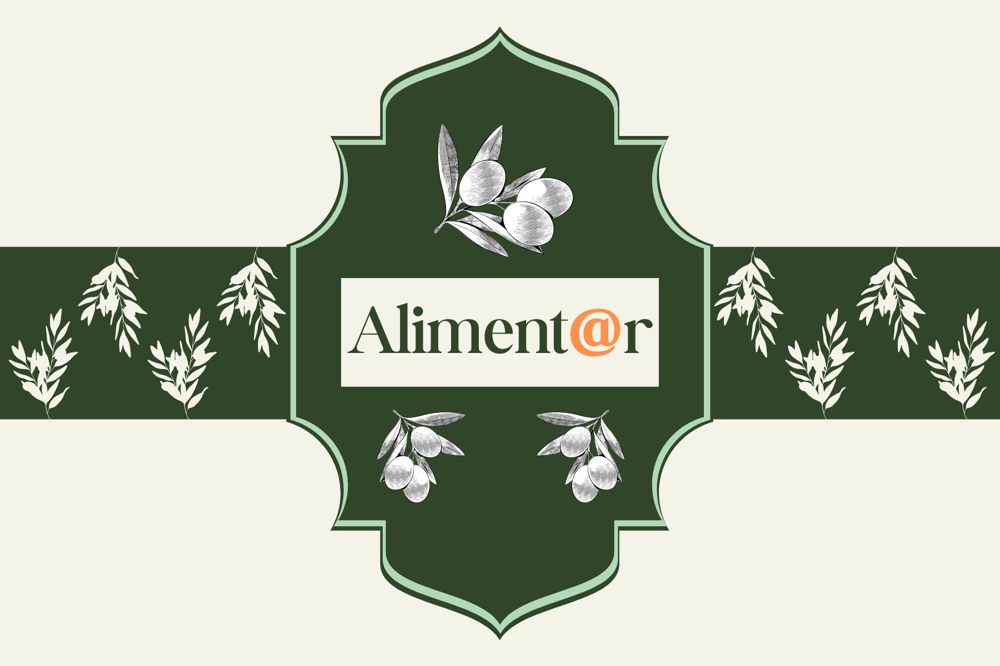

<h1>Aliment@r</h1>

  
  
  
  
  

## 📘 Sobre

- Projeto desenvolvido durante o Hackathon Reprograme-se realizado entre 16 e 18 de fevereiro de 2024.
- O projeto foi construindo em dupla, por mim e Iara Felix, e consistia na construção de uma plataforma web completa de doação de alimentos.
- As tecnologias usadas para construção deveriam ser apenas HTML, CSS, Bootstrap e JavaScript e seguir um briefing pré-definido.

## 🔨 Tecnologias

- HTML5
- CSS3
- Bootstrap
- JavaScript